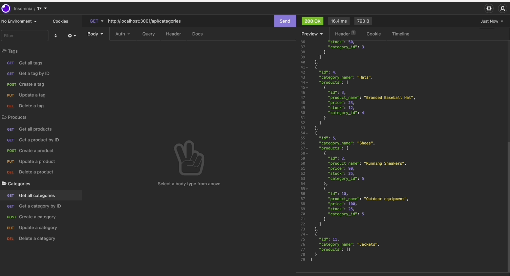

<h1 align="center">E-Commerce Backend</h1>

## Description
This application creates the backend of an e-commerce website using Express.js API and Sequelize to interact with a MySQL database.

## Installation
Clone the repo to your local machine and run the following command to install dependencies:

```bash
npm install
```

Ensure that the following dependencies are installed:

```bash
npm i inquirer
npm i sequelize
npm i dotenv
npm i express
```

## Usage
1. Connect to your MySQL database:
   ```bash
   mysql -u root -p
   ```

2. Run the following command to set up the database schema:
   ```sql
   source schema.sql
   ```

3. Quit MySQL shell and seed the database:
   ```bash
   npm run seed
   ```

4. Start the server:
   ```bash
   npm start
   ```

## Demo
Below is a demonstration of this application. The full walkthrough video can be found on my [Youtube Channel](https://youtu.be/Brnw8__pX88).



Here is the screenshot:


## Built With
- [Javascript](https://developer.mozilla.org/en-US/docs/Web/Javascript)
- [NodeJS](https://nodejs.org/en/)
- [ExpressJS](https://expressjs.com/)
- [MySQL](https://www.mysql.com/)

## License
This application is licensed under the MIT license.

## Tests
To run tests on the application, run:

```bash
npm install jest
npm run test
```

## API List

### Product Management

| Method | Endpoint       | Description              |
|--------|----------------|--------------------------|
| GET    | /api/products  | Get all products         |
| GET    | /api/products/:id | Get product by ID     |
| POST   | /api/products  | Create a new product     |
| PUT    | /api/products/:id | Update a product      |
| DELETE | /api/products/:id | Delete a product      |

### Tag Management

| Method | Endpoint       | Description              |
|--------|----------------|--------------------------|
| GET    | /api/tags      | Get all tags             |
| GET    | /api/tags/:id  | Get tag by ID            |
| POST   | /api/tags      | Create a new tag         |
| PUT    | /api/tags/:id  | Update a tag             |
| DELETE | /api/tags/:id  | Delete a tag             |

## Database Schema

### Products Table

| Column   | Type    | Description                    |
|----------|---------|--------------------------------|
| _id      | Integer | Unique product ID (Primary Key)|
| name     | String  | Name of the product            |
| price    | Decimal | Price of the product           |
| stock    | Integer | Quantity available in stock    |

### Tags Table

| Column     | Type    | Description                   |
|------------|---------|-------------------------------|
| _id        | Integer | Unique tag ID (Primary Key)  |
| tag_name   | String  | Name of the tag               |

### ProductTags Table

| Column      | Type    | Description                            |
|-------------|---------|----------------------------------------|
| _id         | Integer | Unique ProductTag ID (Primary Key)     |
| product_id  | Integer | Foreign key referencing Products Table|
| tag_id      | Integer | Foreign key referencing Tags Table    |

